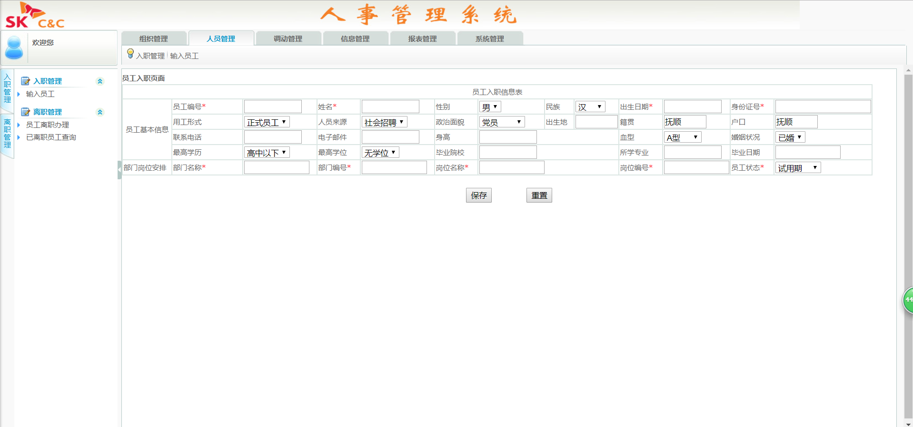

# ManageSystem - 人事管理系统
参加东软实训小学期做的一个Java人事管理系统，系统学习下Web前台（html+css+js），Java Web开发（Servlet+JSP），MVC设计模式，数据库操作（Oracle+JDBC+DAO层封装）。非常基础的技术，没有任何框架。  

虽然只有大约10天，代码写的仓促，功能实现的不完善，系统还有很多崩溃，但这段开发学习的时光，大家在一起，真的很开心，很轻松，很难忘……

## 相关环境
- 开发语言：Java 1.8
- 数据库：Oracle
- 开发工具：Eclipse

## 功能组成
- 人员管理：员工入职、员工离职、离职人员的信息查询
- 部门管理：针对部门信息的增删改查
- 岗位管理：针对岗位信息的增删改查
- 调动管理：人员调动管理、部门调动查询、岗位调动查询
- 系统管理：对管理员的信息的增删改查
- 报表管理：新聘用员工查询、离职员工查询、岗位调动查询、部门调动查询

## 代码结构
- `/src/` 后台工作目录

    `/src/com/manage/controller/` 控制层

    `/src/com/manage/dao/` 数据库访问层

	`/src/com/manage/service/` 服务层
	
	`/src/com/manage/utils/` 包含一些工具类
	
- `/WebContent/` 前台工作目录

## 使用指南
运行程序后，进入：  
登陆url： http://localhost:8080/ManageSystem/show/login.jsp  
主界面url： http://localhost:8080/ManageSystem/show/index.html

## 团队介绍：
- 我们有一个善于领导团队的leader：Qi Wenkai
- 有一个善于辅助的队员：Dou Cunkai
- 有两个个默默工作的：Wanghui， Xuke
- 还有一个负责调节气氛的”吉祥物“：Song Zhenhua

（团队介绍是当时写的，虽然好笑，但还是保留吧。）

